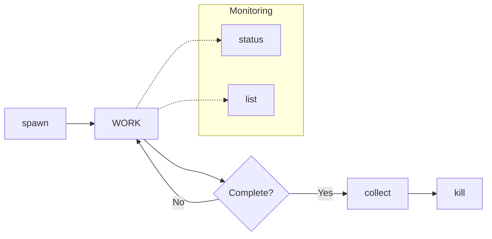
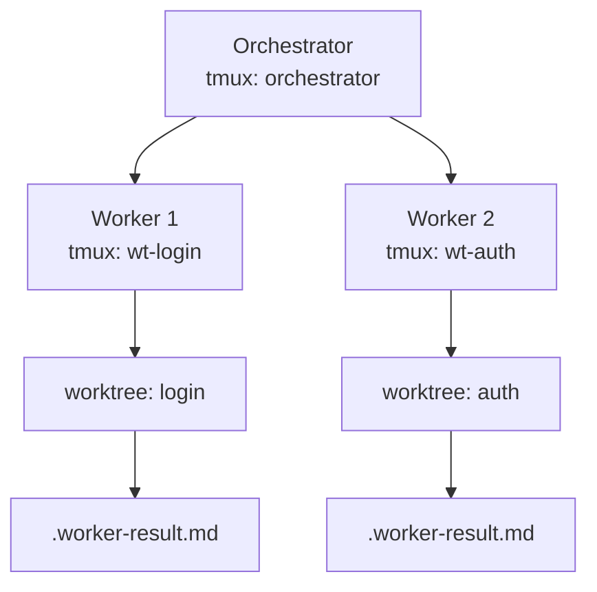

# Worker Orchestrator

tmux 기반 병렬 Claude 인스턴스 관리. git-worktree skill과 연계하여 워커 라이프사이클 지원.

## 워크플로우



## 핵심 개념

### 워커 = Worktree + tmux 세션

| 항목 | 형식 | 예시 |
|------|------|------|
| tmux 세션명 | `wt-{feature}` | `wt-login`, `wt-auth` |
| 결과 파일 | `{worktree}/.worker-result.md` | 워커 작업 결과 저장 |
| 상태 파일 | `{worktree}/.worker-status` | `running`, `done`, `failed` |

### 아키텍처



## .worktree.json 확장

```json
{
  "feature": "login",
  "worker": {
    "session": "wt-login",
    "task": "로그인 API 구현",
    "started_at": "2025-01-20T10:00:00"
  }
}
```

## 명령어

**Placeholder**: `{feature}` = worktree feature명, `{task}` = 작업 내용

### spawn {feature} "{task}"
워커 생성. worktree에 Claude 인스턴스 배치.
- 스크립트: `scripts/spawn.sh`

### status [feature]
워커 상태 확인. feature 없으면 전체 조회.
- 스크립트: `scripts/status.sh`
- 출력: `WORKER | STATUS | DURATION | LAST OUTPUT`

### collect [feature]
완료된 워커 결과 수집. done/failed 상태만.
- 스크립트: `scripts/collect.sh`

### kill {feature}
워커 종료. running 상태면 경고 후 재실행 시 강제 종료.
- 스크립트: `scripts/kill.sh`

### list
활성 워커 목록.
- 스크립트: `scripts/list.sh`

### kill-all [--force]
모든 워커 일괄 종료.
- 스크립트: `scripts/kill-all.sh`

## 결과 수집 프로토콜

```
{task}

완료되면:
1. 결과를 .worker-result.md 에 저장
2. echo "done" > .worker-status
3. "작업 완료" 출력

실패 시:
1. 에러 내용을 .worker-result.md 에 저장
2. echo "failed" > .worker-status
3. "작업 실패" 출력
```

## 안전장치

| 상황 | 동작 | 우회 |
|------|------|------|
| spawn 시 worktree 없음 | 차단 | worktree 먼저 생성 |
| spawn 시 이미 실행 중 | 차단 | kill 후 재시도 |
| kill 시 running 상태 | 경고 | 재실행 시 강제 종료 |
| kill-all 시 running 존재 | 차단 | `--force` |

## 중요 원칙

1. **1:1 매핑**: 워커 = Worktree + tmux 세션
2. **비블로킹**: sleep 대신 파일 기반 통신
3. **명시적 종료**: 완료 후 상태 파일 업데이트 필수
4. **결과 보존**: kill 시 `.worker-result.md` 유지
5. **git-worktree 연계**: worktree 없으면 spawn 불가

## Example

```
# 1. worktree 생성
/git-worktree add login
/git-worktree add auth

# 2. 워커 배치
/worker-orchestrator spawn login "로그인 API 구현"
/worker-orchestrator spawn auth "OAuth2 인증 구현"

# 3. 모니터링
/worker-orchestrator status

# 4. 결과 수집
/worker-orchestrator collect

# 5. 정리
/worker-orchestrator kill login
```

## Technical Details

| 도구 | 용도 | 필수 |
|------|------|------|
| tmux | 세션 관리 | O |
| jq | JSON 파싱 | O |
| git | worktree 조회 | O |

**연계 Skill**: git-worktree (spawn 전 worktree 필요)

**파일 구조**:
```
{worktree}/
├── .worktree.json      # worker 필드
├── .worker-status      # running | done | failed
└── .worker-result.md   # 작업 결과
```

**tmux 세션**: `wt-{feature}` (조회: `tmux list-sessions | grep "^wt-"`)
