# Mermaid Cheatsheet

실무에서 자주 쓰는 Mermaid 다이어그램 문법 요약.

---

## Flowchart

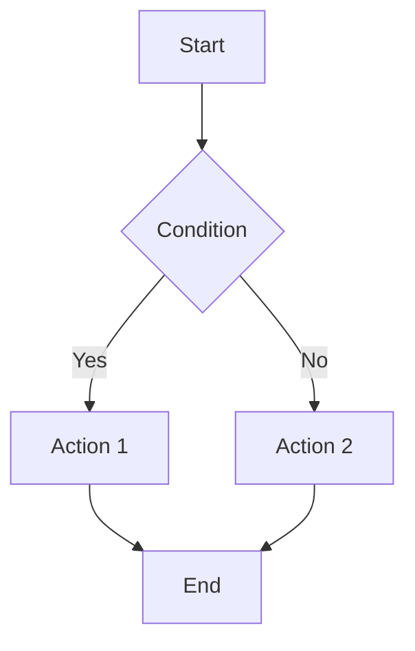

노드 형태:
- `A[text]` 사각형
- `A(text)` 둥근 사각형
- `A{text}` 다이아몬드
- `A([text])` 스타디움
- `A[[text]]` 서브루틴
- `A[(text)]` 실린더 (DB)

방향: `TD` (위→아래), `LR` (왼→오), `BT`, `RL`

링크:
- `-->` 화살표
- `---` 선
- `-->|label|` 라벨 화살표
- `-.->` 점선 화살표
- `==>` 굵은 화살표

서브그래프:
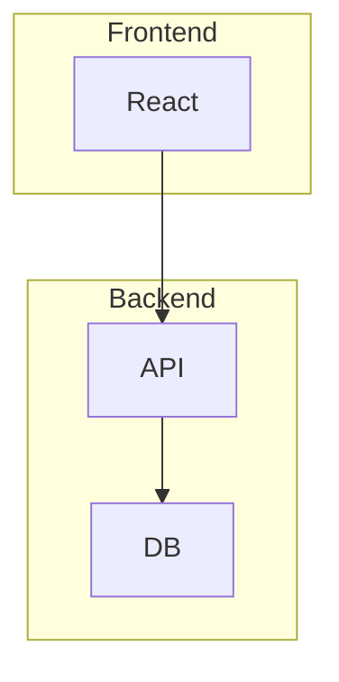

---

## Sequence Diagram

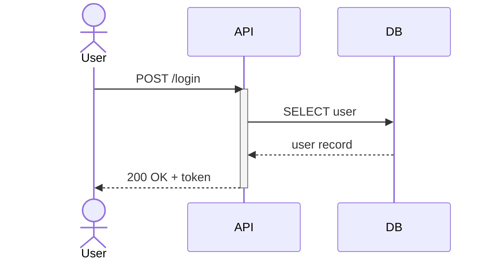

메시지 유형:
- `->>` 실선 화살표
- `-->>` 점선 화살표
- `-x` 실선 + X (실패)
- `-)` 비동기 (열린 화살표)

기능:
- `activate`/`deactivate` 또는 `+`/`-` (활성 박스)
- `Note over A,B: text` 노트
- `loop`/`alt`/`opt`/`par`/`critical` 블록
- `autonumber` 자동 번호

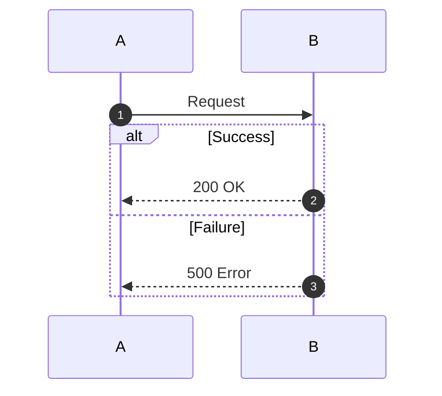

---

## C4 Diagram

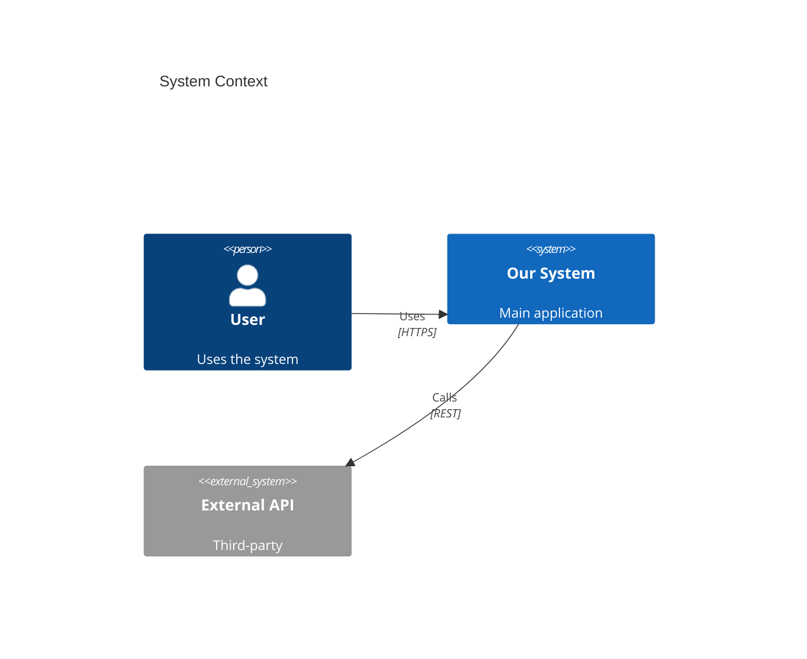

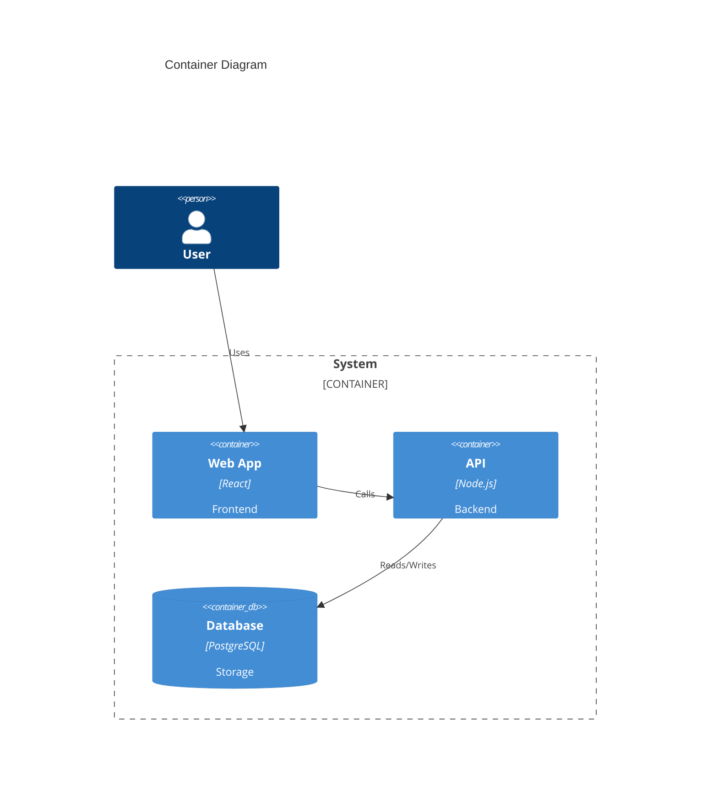

레벨: `C4Context` → `C4Container` → `C4Component` → `C4Dynamic`

---

## ER Diagram

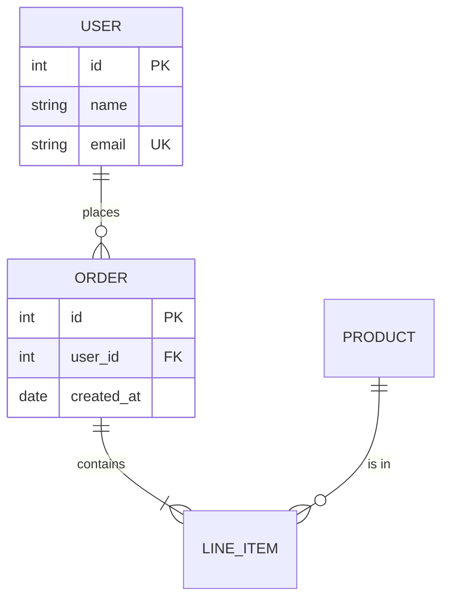

카디널리티:
- `||--||` one to one
- `||--o{` one to zero or more
- `||--|{` one to one or more
- `o{--o{` zero or more to zero or more

---

## State Diagram

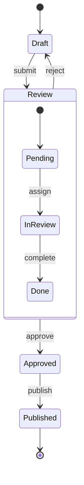

기능:
- `[*]` 시작/종료 상태
- `state Name { }` 복합 상태
- `<<choice>>` 분기점
- `<<fork>>` / `<<join>>` 병렬

---

## Gantt Chart

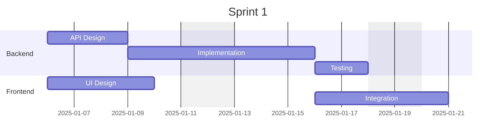

태스크 상태:
- `done` 완료
- `active` 진행 중
- `crit` 크리티컬 패스
- `milestone` 마일스톤 (0d)

---

## Class Diagram

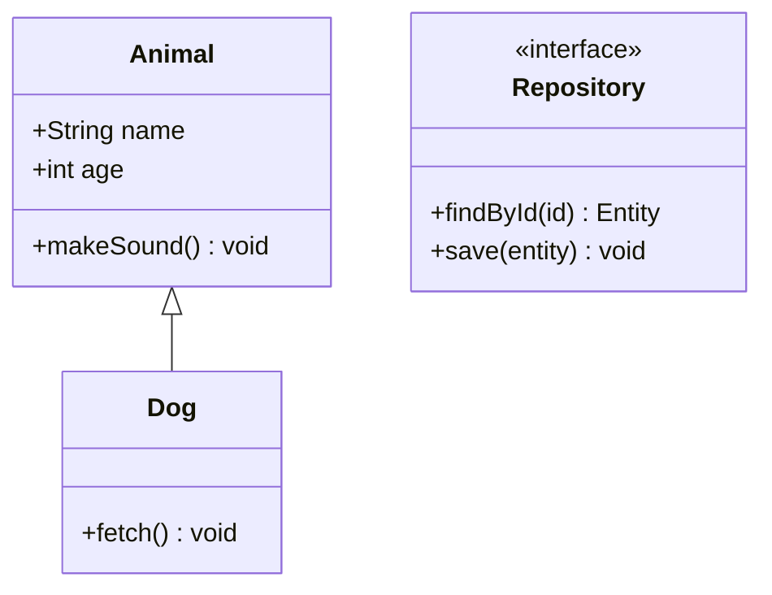

관계:
- `<|--` 상속
- `*--` 컴포지션
- `o--` 집합
- `-->` 연관
- `..>` 의존
- `..|>` 구현

---

## 기타 유용한 유형

### Pie Chart
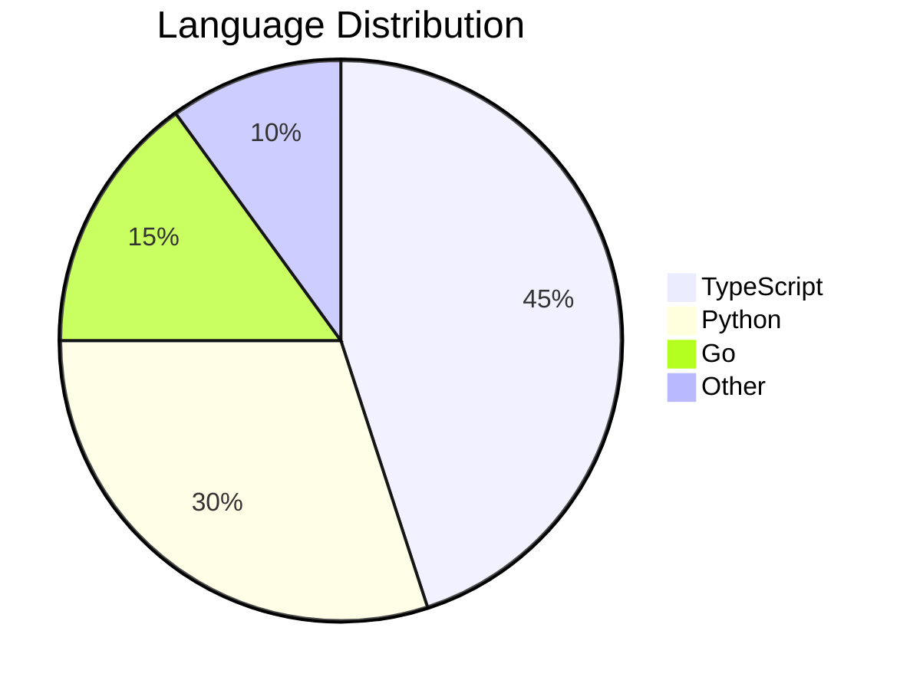

### Git Graph
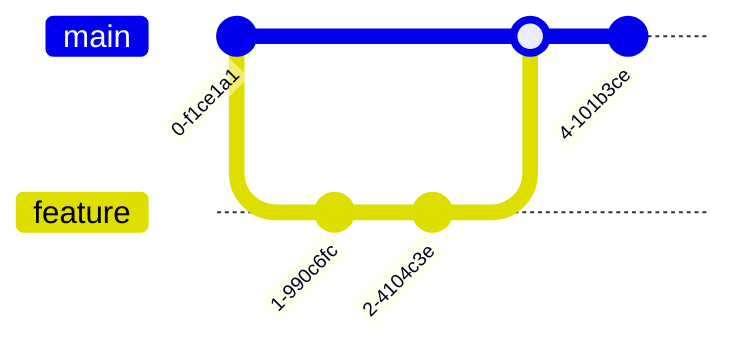

### Mindmap
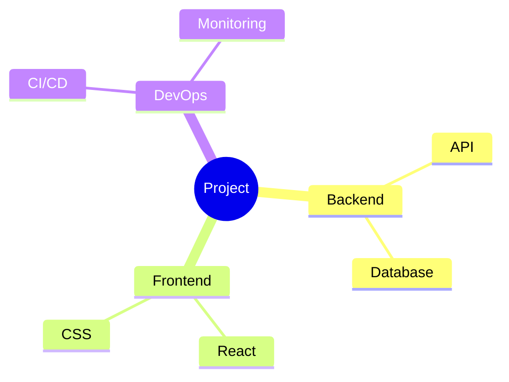
