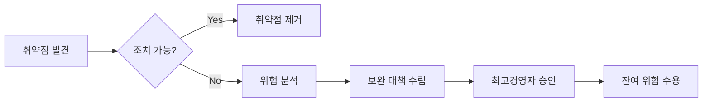

# 취약점 분석평가 (제37조의2~제37조의4)

> 목적: 금융권 취약점 분석평가 요건 상세
> ISMS-P 2.11.2와의 차이점 명시

---

## 1. 개요

전자금융감독규정은 ISMS-P 2.11.2 (취약점 점검 및 조치)보다 **엄격한 요건**을 규정합니다.

| 구분 | ISMS-P 2.11.2 | EFSR 제37조의2~4 |
|------|--------------|-----------------|
| 대상 기준 | 명시 없음 | 총자산 2조원+ 또는 상시종업원 300명+ |
| 평가 주기 | "정기적" (명시 없음) | **연 1회** (홈페이지 6개월 1회) |
| 수행 인력 | 요건 없음 | **자체전담반 5인+** (30% 고급기술인력) |
| 전문기관 | 요건 없음 | **지정 전문기관** (금보원, KISA 등) |
| 보고 의무 | 책임자 보고 | **금융위 제출** + 최고경영자 보고 |
| 침해대응 | 협조체계 권장 | **침해사고대응기관** 지정 체계 |

---

## 2. 제37조의2 (취약점 분석평가 주기, 내용 등)

### 2.1 평가 대상

**제1항** - 다음 요건 중 하나 이상 충족 시 의무:

| 요건 | 기준 |
|------|------|
| 총자산 | **2조원 이상** |
| 상시종업원 수 | **300명 이상** |

> 해당 기관: 제1항 적용 → 자체전담반 필수 또는 평가전문기관 위탁

**제3항** - 제1항 이외 금융회사 및 전자금융업자:

| 대상 | 평가 주기 |
|------|----------|
| 전자금융기반시설 | **연 1회 이상** |
| 홈페이지 | **6개월에 1회 이상** |

### 2.2 자체전담반 구성 (제2항)

**필수 요건**:

```yaml
구성원_수: 5인 이상
CISO_포함: 필수
고급기술인력_비율: 30% 이상
```

**고급기술인력 기준** (금융감독원장이 정하는 기준):
- 정보보호 분야 기사 이상 자격
- 정보보호 업무 경력 5년 이상
- 기타 금감원장이 인정하는 동등 자격

**예외**: 평가전문기관 위탁 시 자체전담반 미구성 가능

### 2.3 평가 내용 (제4항)

평가 대상 시설과 평가기간을 **나누어 평가** 가능:

```
[예시: 연간 평가 계획]
Q1: 핵심 금융시스템 (계정계)
Q2: 채널시스템 (인터넷뱅킹, 모바일)
Q3: 정보계, 대외계
Q4: 홈페이지, DMZ 영역
```

### 2.4 이행계획 수립 및 시행 (제5항)

**준수사항**:

| 단계 | 요건 | 비고 |
|------|------|------|
| 1. 취약점 조치 | 취약점 제거 또는 상응 조치 | 기본 원칙 |
| 2. 조치 불가 시 | **최고경영자 승인** 필요 | 위험 수용 절차 |
| 3. 결과 보고 | 이행결과 **최고경영자에게 보고** | 경영진 책임 |

**위험 수용 프로세스**:



### 2.5 전자금융보조업자 협조 (제6항)

취약점 분석평가 수행 시 **전자금융보조업자에게 협조 요청** 가능:
- 클라우드 서비스 제공자
- 외주 개발 업체
- 시스템 운영 위탁 업체

---

## 3. 제37조의3 (취약점 분석평가 전문기관 지정 등)

### 3.1 평가전문기관 (제1항)

| 유형 | 기관 | 비고 |
|------|------|------|
| 1 | **금융분야 정보공유 및 분석센터** | 금융보안원 (FSI) |
| 2 | **정보보호전문서비스 기업** | KISA 지정 |
| 3 | **침해사고대응기관** | 제37조의4 지정 기관 |
| 4 | **금융위원장 지정자** | 별도 지정 가능 |

**KISA 정보보호전문서비스 기업**:
- 보안컨설팅
- 취약점 진단
- 모의해킹

### 3.2 결과보고서 제출 (제2항)

금융회사 및 전자금융업자는 취약점 분석평가 **결과보고서를 금융위원장에게 제출**

**보고서 포함 사항**:
- 평가 범위 및 대상
- 발견된 취약점 현황
- 위험도 분류 (Critical/High/Medium/Low)
- 조치 계획 및 완료 현황
- 잔여 위험 및 수용 사유

### 3.3 금감원 분석 보고 (제3항)

금융감독원장은 결과보고서 분석 후 **매분기 1개월 이내 금융위원장에게 보고**

```
[연간 보고 일정]
Q1 결과 → 4월 말까지 보고
Q2 결과 → 7월 말까지 보고
Q3 결과 → 10월 말까지 보고
Q4 결과 → 1월 말까지 보고
```

---

## 4. 제37조의4 (침해사고대응기관 지정 및 업무범위 등)

### 4.1 업무범위

| 번호 | 업무 | 상세 |
|------|------|------|
| 1 | **정보공유체계 구축** | 침해사고 정보 수집 및 전파 |
| 2 | **예보/경보 발령** | 침해사고 예보 및 경보 내용 전파 |
| 3 | **원인분석/대응/확산방지** | 침해사고 신속 대응 |
| 4 | **통합 보안관제센터 운영** | 금융권 통합 관제 |
| 5 | **자율기준 마련** | 침해사고 예방/대응 자율기준 |

### 4.2 금융보안원 역할

**금융권 통합 보안관제센터**:

```
[보안관제 체계]
금융회사 보안 로그
       ↓
금융보안원 통합관제
       ↓
위협 탐지/분석/대응
       ↓
침해사고 정보 공유
```

**주요 서비스**:
- 24x7 보안관제
- 침해사고 대응 지원
- 보안 위협 정보 공유 (ISAC)
- 취약점 분석평가 수행/지원

---

## 5. ISMS-P 2.11.2와의 상세 비교

### 5.1 인증기준 비교

**ISMS-P 2.11.2**:
> 정보시스템의 취약점이 노출되어 있는지를 확인하기 위하여 **정기적으로** 취약점 점검을 수행하고 발견된 취약점에 대해서는 **신속하게 조치**하여야 한다.

**EFSR 제37조의2**:
> **연 1회 이상** (홈페이지 6개월 1회), **자체전담반 5인+** (30% 고급기술인력), 결과 **금융위 제출**, **최고경영자 승인/보고**

### 5.2 주요 확인사항 비교

| ISMS-P 2.11.2 확인사항 | EFSR 강화 요건 |
|----------------------|---------------|
| 취약점 점검 절차 수립 | + 자체전담반 구성 요건 |
| 정기적 점검 수행 | + **연 1회/홈페이지 6개월 1회** 명시 |
| 책임자 보고 | + **최고경영자 보고** + 금융위 제출 |
| 조치 결과 기록 | + 조치 불가 시 **CEO 승인** 필요 |

### 5.3 위임 기준

```yaml
# ISMS-P로 위임
위임_가능:
  - 취약점 점검 절차 일반
  - 점검 결과 기록/관리
  - 취약점 이력 관리

# EFSR에서 직접 작성
직접_작성:
  - 자체전담반 구성 요건 (5인+, 30% 고급)
  - 평가 주기 (연 1회, 홈페이지 6개월)
  - 평가전문기관 지정 (금보원, KISA 등)
  - 금융위 결과보고서 제출
  - 최고경영자 승인/보고 절차
  - 침해사고대응기관 체계
```

---

## 6. 실무 체크리스트

### 6.1 평가 대상 확인

- [ ] 총자산 2조원 이상 해당 여부
- [ ] 상시종업원 300명 이상 해당 여부
- [ ] 해당 시 자체전담반 구성 또는 전문기관 위탁 결정

### 6.2 자체전담반 구성 (해당 시)

- [ ] 5인 이상 구성
- [ ] CISO 포함 확인
- [ ] 30% 이상 고급기술인력 확보
- [ ] 전담반 구성 문서화

### 6.3 평가 계획 수립

- [ ] 연간 평가 계획 수립
- [ ] 평가 대상 시설 목록화
- [ ] 평가 기간 분배 (분기별 등)
- [ ] 홈페이지 6개월 주기 반영

### 6.4 평가 수행

- [ ] 평가전문기관 선정 (위탁 시)
- [ ] 취약점 분석평가 수행
- [ ] 발견 취약점 분류 (위험도)
- [ ] 이행계획 수립

### 6.5 조치 및 보고

- [ ] 취약점 조치 수행
- [ ] 조치 불가 항목 최고경영자 승인
- [ ] 이행결과 최고경영자 보고
- [ ] 결과보고서 금융위 제출

---

## 7. 시행일

| 조항 | 시행일 | 상태 |
|------|--------|------|
| 제37조의2 | 2025.2.5 | 시행 완료 |
| 제37조의3 | 2025.2.5 | 시행 완료 |
| 제37조의4 | 2025.2.5 | 시행 완료 |

---

## 출처

- 전자금융감독규정 제2025-4호 (금융위원회고시)
- 국가법령정보센터: https://www.law.go.kr/행정규칙/전자금융감독규정
- ISMS-P 고시 [별표 7] (2023.10.5 개정)
