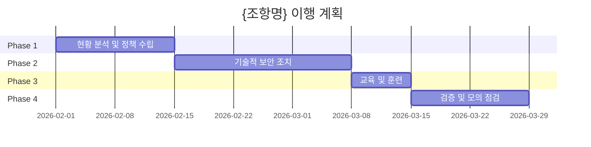

<!--
  전자금융감독규정 이행 계획 템플릿

  사용법:
  1. {조항번호}, {조항명} 등 중괄호 내용을 실제 값으로 교체
  2. Phase별 기간은 조직 상황에 맞게 조정
  3. 담당자, 완료 예정일, 예산 등 빈칸 채우기
  4. Mermaid gantt의 시작일을 실제 날짜로 변경

  예시: /efsr 접근통제 계획
-->

# 전자금융감독규정 이행 계획: {조항명}

## 개요

- 대상 조항: {조항번호 범위}
- 총 항목 수: {N}개
- 예상 기간: {N}주
- 우선순위: {높음/보통/낮음}
- 위험도: {고위험/중위험/저위험}

## 완료 조건

- [ ] 모든 규정 요구사항 문서화
- [ ] 기술적 보안 조치 구현 완료
- [ ] 관련 인력 교육 완료
- [ ] 내부 점검 통과
- [ ] 증빙 자료 구비

## Phase 1: 현황 분석 및 정책 수립 (Week 1-2)

### {조항번호} {조항명}

**목표**: 현행 수준 진단 및 정책/절차 문서화

**태스크**:
- [ ] 현황 진단 (Gap 분석)
- [ ] {조항명} 관련 정책 작성
- [ ] 세부 절차 및 지침 수립
- [ ] 책임자 및 역할 정의
- [ ] 경영진 승인

**산출물**:
- 현황 진단 보고서
- {조항명} 정책서
- {조항명} 절차서/지침서
- 역할 및 책임 매트릭스

**담당자**: ___________
**완료 예정**: ___________

---

## Phase 2: 기술적 보안 조치 (Week 3-5)

### {조항번호} {조항명}

**목표**: 규정 준수를 위한 기술적 구현

**태스크**:
- [ ] 기술 요구사항 분석
- [ ] 솔루션/시스템 선정
- [ ] 구현 및 설정
- [ ] 보안성 검토
- [ ] 단위 테스트

**산출물**:
- 기술 요구사항 명세서
- 솔루션 도입 보고서
- 시스템 설정 문서
- 보안성 검토 결과
- 테스트 결과 보고서

**담당자**: ___________
**완료 예정**: ___________

**기술 스택**:
- ___________
- ___________

---

## Phase 3: 교육 및 훈련 (Week 6)

**목표**: 관련 인력의 규정 이해 및 절차 숙지

**태스크**:
- [ ] 교육 자료 준비
- [ ] 대상자별 교육 실시
  - IT 보안 담당자 교육
  - 시스템 운영자 교육
  - 전체 임직원 보안 인식 교육
- [ ] 교육 이수 기록 관리
- [ ] 교육 효과성 평가

**산출물**:
- 교육 자료 (PPT, 매뉴얼)
- 교육 이수 대장
- 효과성 평가 보고서

**담당자**: ___________
**완료 예정**: ___________

---

## Phase 4: 검증 및 모의 점검 (Week 7-8)

**목표**: 규정 준수 여부 검증 및 보완

**태스크**:
- [ ] 정책/절차 이행 여부 점검
- [ ] 기술적 보안 조치 검증
- [ ] 통합 테스트 수행
- [ ] 모의 감독검사 실시
- [ ] 발견사항 조치

**산출물**:
- 자체 점검 체크리스트
- 검증 보고서
- 모의 감독검사 보고서
- 시정 조치 결과서

**담당자**: ___________
**완료 예정**: ___________

---

## 리스크 및 대응

| 리스크 | 영향도 | 발생 가능성 | 대응 방안 |
|--------|--------|-------------|----------|
| 레거시 시스템과의 호환성 | 높음 | 중간 | 단계적 적용, 파일럿 테스트 |
| 예산 확보 지연 | 중간 | 중간 | 우선순위 기반 단계적 투자 |
| 전문 인력 부족 | 높음 | 중간 | 외부 전문가 활용, 교육 강화 |
| 일정 지연 | 높음 | 중간 | 주간 점검, 조기 경보 체계 |
| 금융감독원 검사 일정 변동 | 중간 | 낮음 | 상시 준비 체계 유지 |

## 의존성

**선행 필요 항목**:
- {조항번호}: {조항명} - {이유}

**후속 작업**:
- {조항번호}: {조항명} - {이유}

## 예산

| 항목 | 예상 비용 | 비고 |
|------|----------|------|
| 보안 솔루션 도입 | ___________원 | |
| 시스템 구축/개선 | ___________원 | |
| 교육 | ___________원 | |
| 외부 컨설팅 | ___________원 | |
| 보안 감사 | ___________원 | |
| **합계** | **___________원** | |

## 추적 지표

- [ ] 정책 문서 승인 완료
- [ ] 기술 구현 완료율: 0%
- [ ] 교육 이수율: 0%
- [ ] 자체 점검 준수율: 0%
- [ ] 증빙 자료 구비율: 0%

## 마일스톤

**[중요] 아래 Mermaid 차트의 시작일(2026-02-01)을 실제 프로젝트 시작일로 변경하세요.**

---

**참고 문서**: prompts/skills/efsr/resources/{파일명}.md

**검토 주기**: 주 1회

**최종 업데이트**: {날짜}
