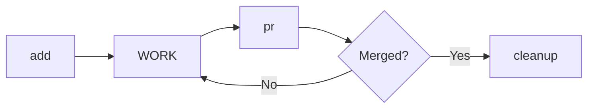

# Git Worktree

Git worktree를 활용한 병렬 개발 관리. 전체 라이프사이클 지원.

## 라이프사이클



## 네이밍 컨벤션

| 항목 | 형식 | 예시 |
|------|------|------|
| 디렉토리 | `../worktrees/{repo}_{feature}_{YYMMDD}` | `../worktrees/myapp_login_260113` |
| 브랜치 | `fix/{feature}` 또는 `feature/{feature}` | `fix/login`, `feature/auth` |
| feature 이름 | 소문자, 숫자, `_`, `-` 만 허용 | `login`, `user-auth`, `api_v2` |

---

## 명령어

### add {feature} [--type fix|feature]

새 작업 시작. worktree + 브랜치 생성.

```bash
set -e  # 에러 시 즉시 종료

# 1. feature 이름 검증
[[ "{feature}" =~ ^[a-z0-9_-]+$ ]] || {
  echo "❌ feature 이름: 소문자, 숫자, _, - 만 허용" >&2
  exit 1
}

# 2. worktrees 디렉토리 확인
mkdir -p ../worktrees

# 3. 변수 설정
REPO=$(basename $(git rev-parse --show-toplevel))
DATE=$(date +%y%m%d)
BRANCH_TYPE="${TYPE:-fix}"  # 기본값 fix, --type으로 변경 가능
BRANCH="${BRANCH_TYPE}/{feature}"
WORKTREE_PATH="../worktrees/${REPO}_{feature}_${DATE}"

# 4. 기존 worktree 확인 (정확한 경계 매칭)
# WHY: 부분 문자열 오탐 방지 (login vs login2)
PATTERN="/${REPO}_{feature}_[0-9]{6}(\s|$)"
if git worktree list | grep -Eq "$PATTERN"; then
  EXISTING=$(git worktree list | grep -E "$PATTERN" | awk '{print $1}' | head -1)
  echo "⚠️ 이미 존재: ${EXISTING}"
  echo "📁 cd ${EXISTING}"
  exit 0
fi

# 5. 브랜치 충돌 확인
if git show-ref --verify --quiet refs/heads/${BRANCH}; then
  BRANCH="${BRANCH}-${DATE}"
  echo "⚠️ 브랜치 충돌. 변경: ${BRANCH}"
fi

# 6. base 브랜치 감지 (검증 포함)
# WHY: origin/HEAD 우선, 없으면 main/master fallback
BASE=$(git symbolic-ref --short refs/remotes/origin/HEAD 2>/dev/null | sed 's|origin/||')
if [ -z "$BASE" ]; then
  if git show-ref --verify --quiet refs/remotes/origin/main; then
    BASE="main"
  elif git show-ref --verify --quiet refs/remotes/origin/master; then
    BASE="master"
  else
    echo "❌ base 브랜치를 찾을 수 없습니다" >&2
    echo "💡 다음 명령어로 설정하세요:" >&2
    echo "   git remote set-head origin main" >&2
    exit 1
  fi
fi

# 7. worktree 생성
git worktree add ${WORKTREE_PATH} -b ${BRANCH} origin/${BASE}

echo "✅ worktree 생성: ${WORKTREE_PATH}"
echo "📁 cd ${WORKTREE_PATH}"
```

---

### list

현재 worktree 목록 + PR 상태 확인.

```bash
echo "PATH                              BRANCH              PR STATUS"
echo "================================================================"

git worktree list --porcelain | grep "^worktree" | sed 's/worktree //' | while read path; do
  BRANCH=$(git -C "$path" branch --show-current 2>/dev/null || echo "-")
  if [ "$BRANCH" != "-" ]; then
    PR=$(gh pr list --head "$BRANCH" --json number,state --jq '.[0] | "#\(.number) (\(.state))"' 2>/dev/null || echo "-")
  else
    PR="-"
  fi
  printf "%-35s %-20s %s\n" "$path" "$BRANCH" "$PR"
done
```

---

### switch {feature}

다른 worktree로 전환 안내.

```bash
WORKTREE=$(git worktree list | grep "{feature}" | awk '{print $1}')

if [ -z "$WORKTREE" ]; then
  echo "❌ worktree를 찾을 수 없음: {feature}"
  echo "💡 git worktree list 로 확인하세요"
  exit 1
fi

echo "📁 다음 명령어를 실행하세요:"
echo "   cd ${WORKTREE}"
```

**참고**: Claude는 직접 cd 불가. 사용자에게 경로 안내.

---

### pr {feature}

PR 생성. 사용자에게 명령어 제공.

```bash
WORKTREE=$(git worktree list | grep "{feature}" | awk '{print $1}')
BRANCH=$(git -C "$WORKTREE" branch --show-current)

echo "📋 다음 명령어를 순서대로 실행하세요:"
echo ""
echo "   cd ${WORKTREE}"
echo "   git push -u origin ${BRANCH}"
echo "   gh pr create --title '${BRANCH}: ...' --body '...'"
```

**또는** worktree 내에서 직접 실행:

```bash
# worktree 디렉토리에서 실행
git push -u origin $(git branch --show-current)
gh pr create
```

---

### cleanup {feature} [--force] [--delete-remote]

머지된 작업 정리. worktree + 브랜치 삭제.

```bash
# 1. worktree 경로 찾기
WORKTREE=$(git worktree list | grep "{feature}" | awk '{print $1}')
BRANCH=$(git -C "$WORKTREE" branch --show-current 2>/dev/null)

if [ -z "$WORKTREE" ]; then
  echo "❌ worktree를 찾을 수 없음: {feature}"
  exit 1
fi

# 2. PR 머지 상태 확인
STATE=$(gh pr list --head "$BRANCH" --state all --json state --jq '.[0].state' 2>/dev/null)

if [ "$STATE" != "MERGED" ] && [ "$FORCE" != "true" ]; then
  echo "❌ PR이 머지되지 않음 (state: ${STATE:-unknown})"
  echo "💡 강제 삭제: cleanup {feature} --force"
  exit 1
fi

# 3. 변경사항 확인 (한 번에 체크)
STATUS=$(git -C ${WORKTREE} status --porcelain)

if [ -n "$STATUS" ]; then
  echo "❌ 커밋되지 않은 변경:"
  echo "$STATUS"

  # untracked 파일(??로 시작) 있으면 추가 경고
  if echo "$STATUS" | grep -q "^??"; then
    echo ""
    echo "⚠️ untracked 파일(??)은 삭제됩니다. 보존 필요 시:"
  else
    echo ""
    echo "💡 옵션:"
  fi
  echo "   1) git -C ${WORKTREE} stash -u  # untracked 포함 stash"
  echo "   2) git -C ${WORKTREE} add -A && git -C ${WORKTREE} commit -m 'wip'"
  exit 1
fi

# 4. worktree 제거
git worktree remove ${WORKTREE}
echo "✅ worktree 제거: ${WORKTREE}"

# 5. 로컬 브랜치 삭제
if ! git branch -d ${BRANCH} 2>/dev/null; then
  echo "⚠️ 브랜치가 완전히 머지되지 않음. 강제 삭제 중..."
  git branch -D ${BRANCH}
fi
echo "✅ 로컬 브랜치 삭제: ${BRANCH}"

# 6. 원격 브랜치 삭제 (--delete-remote 플래그로 자동화 가능)
if [ "$DELETE_REMOTE" = "true" ]; then
  git push origin --delete ${BRANCH} 2>/dev/null || echo "⚠️ 원격 브랜치 삭제 실패 (이미 삭제됨)"
  echo "✅ 원격 브랜치 삭제: ${BRANCH}"
else
  echo ""
  echo "💡 원격 브랜치도 삭제하려면:"
  echo "   git push origin --delete ${BRANCH}"
fi
```

---

### prune

고아 worktree 일괄 정리.

```bash
PRUNABLE=$(git worktree list --porcelain | grep -c "prunable" 2>/dev/null || echo 0)

if [ "$PRUNABLE" -eq 0 ]; then
  echo "✅ 정리할 고아 worktree 없음"
else
  echo "🗑️ ${PRUNABLE}개 고아 worktree 정리 중..."
  if git worktree prune -v; then
    echo "✅ 정리 완료"
  else
    echo "❌ 정리 실패 (exit code: $?)" >&2
    exit 1
  fi
fi
```

---

## 안전장치

| 상황 | 동작 | 우회 방법 |
|------|------|----------|
| cleanup 시 PR 미머지 | 차단 | `--force` 플래그 |
| cleanup 시 uncommitted 변경 | 차단 + stash 안내 | `stash -u` 또는 commit 후 재시도 |
| cleanup 시 untracked 파일 | 경고 + 차단 | commit으로 보존 또는 삭제 확인 |
| 이미 존재하는 worktree | 기존 경로 안내 | 기존 worktree 사용 |
| 원격 브랜치 삭제 | 명령어만 제공 | `--delete-remote` 플래그 |
| feature 이름 규칙 위반 | 차단 | 규칙에 맞게 수정 |

---

## Examples

### 새 기능 작업 시작
```
User: "login 기능 작업 시작"
→ add login
→ worktree 생성: ../worktrees/myapp_login_260113
→ "cd ../worktrees/myapp_login_260113"
```

### 대규모 기능 (feature 브랜치)
```
User: "auth 기능 작업, feature 브랜치로"
→ add auth --type feature
→ 브랜치: feature/auth
→ worktree 생성: ../worktrees/myapp_auth_260113
```

### 작업 완료 후 PR
```
User: "login PR 만들어줘"
→ pr login
→ 명령어 안내: cd, push, gh pr create
```

### 머지 후 정리
```
User: "login 정리해줘"
→ cleanup login
→ PR 머지 확인 → worktree 제거 → 브랜치 삭제
→ "✅ 정리 완료"
```

### 강제 정리 (PR 없이)
```
User: "login 강제 삭제"
→ cleanup login --force
→ worktree + 브랜치 삭제 (PR 상태 무시)
```

### 전체 현황 확인
```
User: "worktree 목록"
→ list
→ 경로, 브랜치, PR 상태 테이블 출력
```
