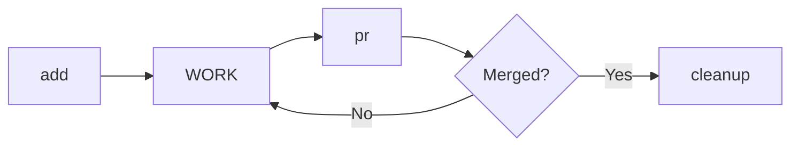

# Git Worktree

Git worktree를 활용한 병렬 개발 관리. 전체 라이프사이클 지원.

## 라이프사이클



## 네이밍 컨벤션

| 항목 | 형식 | 예시 |
|------|------|------|
| 디렉토리 | `../worktrees/{repo}_{feature}_{YYMMDD}` | `../worktrees/myapp_login_260113` |
| 브랜치 | `fix/{feature}` 또는 `feature/{feature}` | `fix/login`, `feature/auth` |
| feature 이름 | 소문자, 숫자, `_`, `-` 만 허용 | `login`, `user-auth`, `api_v2` |

---

## .worktree.json 스키마

각 worktree 루트에 생성되는 설정 파일. 포트 관리, 환경변수, 스크립트 정의.

```json
{
  "feature": "login",
  "created": "2025-01-20",
  "ports": {
    "api": 3001,
    "db": 5433,
    "dev": 5173
  },
  "env": {
    "PORT": "{{ports.api}}",
    "DB_PORT": "{{ports.db}}",
    "CORS_ORIGINS": "http://localhost:{{ports.dev}}"
  },
  "scripts": {
    "dev": "pnpm dev",
    "test": "pnpm test"
  }
}
```

| 필드 | 설명 | 필수 |
|------|------|------|
| `feature` | feature 이름 | O |
| `created` | 생성 일자 (YYYY-MM-DD) | O |
| `ports.*` | 포트 정의 (api, db, dev 등 자유롭게) | - |
| `env` | 환경변수 맵 (`{{ports.xxx}}` 템플릿 지원) | - |
| `scripts` | 실행 가능한 스크립트 | - |

**포트 할당**: 기존 worktree들의 `.worktree.json`을 스캔하여 충돌 없는 포트 자동 할당. 프로젝트 특성에 맞게 범위 조정.

---

## 명령어

### add {feature} [--type fix|feature]

새 작업 시작. worktree + 브랜치 생성.

```bash
set -e  # 에러 시 즉시 종료

# 1. feature 이름 검증
[[ "{feature}" =~ ^[a-z0-9_-]+$ ]] || {
  echo "❌ feature 이름: 소문자, 숫자, _, - 만 허용" >&2
  exit 1
}

# 2. worktrees 디렉토리 확인
mkdir -p ../worktrees

# 3. 변수 설정
REPO=$(basename "$(git rev-parse --show-toplevel)")
DATE=$(date +%y%m%d)
BRANCH_TYPE="${TYPE:-fix}"  # 기본값 fix, --type으로 변경 가능
BRANCH="${BRANCH_TYPE}/{feature}"
WORKTREE_PATH="../worktrees/${REPO}_{feature}_${DATE}"

# 4. 기존 worktree 확인 (정확한 경계 매칭)
# WHY: 부분 문자열 오탐 방지 (login vs login2)
PATTERN="/${REPO}_{feature}_[0-9]{6}(\s|$)"
if git worktree list | grep -Eq "$PATTERN"; then
  EXISTING=$(git worktree list | grep -E "$PATTERN" | awk '{print $1}' | head -1)
  echo "⚠️ 이미 존재: ${EXISTING}"
  echo "📁 cd ${EXISTING}"
  exit 0
fi

# 5. 브랜치 충돌 확인
if git show-ref --verify --quiet "refs/heads/${BRANCH}"; then
  BRANCH="${BRANCH}-${DATE}"
  echo "⚠️ 브랜치 충돌. 변경: ${BRANCH}"
fi

# 6. base 브랜치 감지 (검증 포함)
# WHY: origin/HEAD 우선, 없으면 main/master fallback
BASE=$(git symbolic-ref --short refs/remotes/origin/HEAD 2>/dev/null | sed 's|origin/||')
if [ -z "$BASE" ]; then
  if git show-ref --verify --quiet refs/remotes/origin/main; then
    BASE="main"
  elif git show-ref --verify --quiet refs/remotes/origin/master; then
    BASE="master"
  else
    echo "❌ base 브랜치를 찾을 수 없습니다" >&2
    echo "💡 다음 명령어로 설정하세요:" >&2
    echo "   git remote set-head origin main" >&2
    exit 1
  fi
fi

# 7. worktree 생성
git worktree add "${WORKTREE_PATH}" -b "${BRANCH}" "origin/${BASE}"

# 8. .worktree.json 생성 (포트 자동 할당)
# WHY: 멀티 worktree 환경에서 포트 충돌 방지
allocate_port() {
  local base=$1 key=$2
  local used_ports=$(find ../worktrees -name ".worktree.json" -exec cat {} \; 2>/dev/null | \
    grep -o "\"$key\": *[0-9]*" | grep -o '[0-9]*' | sort -n)
  local port=$base
  while echo "$used_ports" | grep -q "^${port}$"; do
    port=$((port + 1))
  done
  echo $port
}

API_PORT=$(allocate_port 3001 "api")
DB_PORT=$(allocate_port 5433 "db")
DEV_PORT=$(allocate_port 5173 "dev")

cat > "${WORKTREE_PATH}/.worktree.json" << EOF
{
  "feature": "{feature}",
  "created": "$(date +%Y-%m-%d)",
  "ports": {
    "api": ${API_PORT},
    "db": ${DB_PORT},
    "dev": ${DEV_PORT}
  },
  "env": {
    "PORT": "{{ports.api}}",
    "DB_PORT": "{{ports.db}}",
    "CORS_ORIGINS": "http://localhost:{{ports.dev}}"
  },
  "scripts": {
    "dev": "pnpm dev",
    "test": "pnpm test"
  }
}
EOF

echo "✅ worktree 생성: ${WORKTREE_PATH}"
echo "📁 cd ${WORKTREE_PATH}"
echo "🔌 포트: api=${API_PORT}, db=${DB_PORT}, dev=${DEV_PORT}"
```

---

### list

현재 worktree 목록 + PR 상태 확인.

```bash
echo "PATH                              BRANCH              PR STATUS"
echo "================================================================"

git worktree list --porcelain | grep "^worktree" | sed 's/worktree //' | while read path; do
  BRANCH=$(git -C "$path" branch --show-current 2>/dev/null || echo "-")
  if [ "$BRANCH" != "-" ]; then
    PR=$(gh pr list --head "$BRANCH" --json number,state --jq '.[0] | "#\(.number) (\(.state))"' 2>/dev/null || echo "-")
  else
    PR="-"
  fi
  printf "%-35s %-20s %s\n" "$path" "$BRANCH" "$PR"
done
```

---

### switch {feature}

다른 worktree로 전환 안내.

```bash
WORKTREE=$(git worktree list | grep "{feature}" | awk '{print $1}')

if [ -z "$WORKTREE" ]; then
  echo "❌ worktree를 찾을 수 없음: {feature}"
  echo "💡 git worktree list 로 확인하세요"
  exit 1
fi

echo "📁 다음 명령어를 실행하세요:"
echo "   cd ${WORKTREE}"
```

**참고**: Claude는 직접 cd 불가. 사용자에게 경로 안내.

---

### pr {feature}

PR 생성. 사용자에게 명령어 제공.

```bash
WORKTREE=$(git worktree list | grep "{feature}" | awk '{print $1}')
BRANCH=$(git -C "$WORKTREE" branch --show-current)

echo "📋 다음 명령어를 순서대로 실행하세요:"
echo ""
echo "   cd ${WORKTREE}"
echo "   git push -u origin ${BRANCH}"
echo "   gh pr create --title '${BRANCH}: ...' --body '...'"
```

**또는** worktree 내에서 직접 실행:

```bash
# worktree 디렉토리에서 실행
git push -u origin "$(git branch --show-current)"
gh pr create
```

---

### cleanup {feature} [--force] [--delete-remote]

머지된 작업 정리. worktree + 브랜치 삭제.

```bash
# 1. worktree 경로 찾기
WORKTREE=$(git worktree list | grep "{feature}" | awk '{print $1}')
BRANCH=$(git -C "$WORKTREE" branch --show-current 2>/dev/null)

if [ -z "$WORKTREE" ]; then
  echo "❌ worktree를 찾을 수 없음: {feature}"
  exit 1
fi

# 2. PR 머지 상태 확인
STATE=$(gh pr list --head "$BRANCH" --state all --json state --jq '.[0].state' 2>/dev/null)

if [ "$STATE" != "MERGED" ] && [ "$FORCE" != "true" ]; then
  echo "❌ PR이 머지되지 않음 (state: ${STATE:-unknown})"
  echo "💡 강제 삭제: cleanup {feature} --force"
  exit 1
fi

# 3. 변경사항 확인 (한 번에 체크)
STATUS=$(git -C "${WORKTREE}" status --porcelain)

if [ -n "$STATUS" ]; then
  echo "❌ 커밋되지 않은 변경:"
  echo "$STATUS"

  # untracked 파일(??로 시작) 있으면 추가 경고
  if echo "$STATUS" | grep -q "^??"; then
    echo ""
    echo "⚠️ untracked 파일(??)은 삭제됩니다. 보존 필요 시:"
  else
    echo ""
    echo "💡 옵션:"
  fi
  echo "   1) git -C ${WORKTREE} stash -u  # untracked 포함 stash"
  echo "   2) git -C ${WORKTREE} add -A && git -C ${WORKTREE} commit -m 'wip'"
  exit 1
fi

# 4. worktree 제거
git worktree remove "${WORKTREE}"
echo "✅ worktree 제거: ${WORKTREE}"

# 5. 로컬 브랜치 삭제
if ! git branch -d "${BRANCH}" 2>/dev/null; then
  echo "⚠️ 브랜치가 완전히 머지되지 않음. 강제 삭제 중..."
  git branch -D "${BRANCH}"
fi
echo "✅ 로컬 브랜치 삭제: ${BRANCH}"

# 6. 원격 브랜치 삭제 (--delete-remote 플래그로 자동화 가능)
if [ "$DELETE_REMOTE" = "true" ]; then
  git push origin --delete "${BRANCH}" 2>/dev/null || echo "⚠️ 원격 브랜치 삭제 실패 (이미 삭제됨)"
  echo "✅ 원격 브랜치 삭제: ${BRANCH}"
else
  echo ""
  echo "💡 원격 브랜치도 삭제하려면:"
  echo "   git push origin --delete ${BRANCH}"
fi

# 7. 관련 파일 정리 (있으면)

# .plan 디렉토리 내 관련 파일 삭제
if [ -d ".plan" ]; then
  if find .plan \( -name "*{feature}*" -o -name "*${BRANCH}*" \) -print -quit 2>/dev/null | grep -q .; then
    find .plan \( -name "*{feature}*" -o -name "*${BRANCH}*" \) -print0 2>/dev/null | xargs -0 rm -f
    echo "✅ .plan 파일 삭제"
  fi
fi

# .tmp/ports.json에서 해당 항목 제거
if [ -f ".tmp/ports.json" ] && command -v jq &>/dev/null; then
  if jq -e ".[\"{feature}\"]" .tmp/ports.json &>/dev/null; then
    jq "del(.[\"{feature}\"])" .tmp/ports.json > .tmp/ports.json.tmp
    mv .tmp/ports.json.tmp .tmp/ports.json
    echo "✅ ports.json 정리"
  fi
fi
```

---

### prune

고아 worktree 일괄 정리.

```bash
PRUNABLE=$(git worktree list --porcelain | grep -c "prunable" 2>/dev/null || echo 0)

if [ "$PRUNABLE" -eq 0 ]; then
  echo "✅ 정리할 고아 worktree 없음"
else
  echo "🗑️ ${PRUNABLE}개 고아 worktree 정리 중..."
  git worktree prune -v
  echo "✅ 정리 완료"
fi
```

---

### ports

모든 worktree의 포트 할당 현황 확인.

```bash
echo "WORKTREE                          API    DB     DEV    ACTIVE"
echo "============================================================="

find ../worktrees -name ".worktree.json" 2>/dev/null | while read config; do
  WORKTREE_DIR=$(dirname "$config")
  WORKTREE_NAME=$(basename "$WORKTREE_DIR")

  API=$(jq -r '.ports.api // "-"' "$config" 2>/dev/null)
  DB=$(jq -r '.ports.db // "-"' "$config" 2>/dev/null)
  DEV=$(jq -r '.ports.dev // "-"' "$config" 2>/dev/null)

  # 실제 사용 중인지 lsof로 확인
  ACTIVE=""
  [ "$API" != "-" ] && lsof -i:$API &>/dev/null && ACTIVE="${ACTIVE}api "
  [ "$DB" != "-" ] && lsof -i:$DB &>/dev/null && ACTIVE="${ACTIVE}db "
  [ "$DEV" != "-" ] && lsof -i:$DEV &>/dev/null && ACTIVE="${ACTIVE}dev "

  printf "%-35s %-6s %-6s %-6s %s\n" "$WORKTREE_NAME" "$API" "$DB" "$DEV" "${ACTIVE:--}"
done
```

---

### run {script_name}

`.worktree.json`의 env와 scripts 기반으로 실행.

```bash
# 현재 디렉토리에서 .worktree.json 확인
if [ ! -f ".worktree.json" ]; then
  echo "❌ .worktree.json이 없습니다. worktree 루트에서 실행하세요."
  exit 1
fi

SCRIPT=$(jq -r ".scripts[\"{script_name}\"] // empty" .worktree.json)

if [ -z "$SCRIPT" ]; then
  echo "❌ 스크립트를 찾을 수 없음: {script_name}"
  echo "💡 사용 가능한 스크립트:"
  jq -r '.scripts | keys[]' .worktree.json 2>/dev/null | sed 's/^/   /'
  exit 1
fi

# {{ports.xxx}} 템플릿 변수 치환
resolve_template() {
  local value="$1"
  local api=$(jq -r '.ports.api // ""' .worktree.json)
  local db=$(jq -r '.ports.db // ""' .worktree.json)
  local dev=$(jq -r '.ports.dev // ""' .worktree.json)

  echo "$value" | sed "s/{{ports.api}}/$api/g" | sed "s/{{ports.db}}/$db/g" | sed "s/{{ports.dev}}/$dev/g"
}

# env 환경변수 구성
ENV_VARS=""
for key in $(jq -r '.env | keys[]' .worktree.json 2>/dev/null); do
  raw_value=$(jq -r ".env[\"$key\"]" .worktree.json)
  resolved=$(resolve_template "$raw_value")
  ENV_VARS="${ENV_VARS}${key}=${resolved} "
done

echo "🚀 실행: ${ENV_VARS}${SCRIPT}"
eval "${ENV_VARS}${SCRIPT}"
```

**사용 예시:**
```bash
cd ../worktrees/myapp_login_260113
# .worktree.json의 scripts.dev 실행 (env 자동 적용)
# → PORT=3001 DB_PORT=5433 CORS_ORIGINS=http://localhost:5173 pnpm dev
```

---

## 프로세스 종료 원칙

멀티 worktree 환경에서 다른 작업자에게 영향을 주지 않도록 주의.

| 금지 | 허용 |
|------|------|
| `pkill -f "node"` | PID 기반: `kill $(cat .pid)` |
| `pkill -f "nest"` | 경로 기반: `pkill -f "worktrees/myapp_login.*node"` |
| `kill $(lsof -t -i:3000)` | lsof 확인 후 경로 검증 |

**안전한 종료 패턴:**

```bash
# 방법 1: PID 파일 사용
pnpm dev & echo $! > .pid
kill $(cat .pid)

# 방법 2: 특정 worktree 경로로 필터링
pkill -f "worktrees/myapp_login.*node"

# 방법 3: lsof로 확인 후 경로 검증
lsof -i:3001  # PID와 COMMAND 확인
# 해당 PID가 자신의 worktree인지 확인 후 종료

# 방법 4: tmux 세션 사용
tmux kill-session -t my-dev-server
```

**종료 전 확인사항:**
1. 해당 프로세스가 자신의 worktree에서 실행된 것인지 확인
2. 다른 터미널/tmux 세션에서 실행 중인 작업이 없는지 확인
3. 불확실하면 `lsof -i:{port}`로 먼저 확인

---

## 중요 원칙

1. **독립적 작업 공간**: 각 worktree는 완전히 독립된 작업 환경 제공
2. **네이밍 일관성**: `{repo}_{feature}_{YYMMDD}` 형식으로 추적 용이
3. **안전한 정리**: PR 머지 확인 후 cleanup, 강제 삭제는 명시적 플래그 필요
4. **Claude 제약 인식**: cd 불가 → 경로 안내, 사용자가 직접 이동

---

## 안전장치

| 상황 | 동작 | 우회 방법 |
|------|------|----------|
| cleanup 시 PR 미머지 | 차단 | `--force` 플래그 |
| cleanup 시 uncommitted 변경 | 차단 + stash 안내 | `stash -u` 또는 commit 후 재시도 |
| cleanup 시 untracked 파일 | 경고 + 차단 | commit으로 보존 또는 삭제 확인 |
| 이미 존재하는 worktree | 기존 경로 안내 | 기존 worktree 사용 |
| 원격 브랜치 삭제 | 명령어만 제공 | `--delete-remote` 플래그 |
| .plan 파일 | 관련 파일 자동 삭제 | feature/브랜치 이름 매칭 |
| ports.json | 해당 항목 자동 제거 | jq 설치 필요 |
| feature 이름 규칙 위반 | 차단 | 규칙에 맞게 수정 |

---

## Examples

### 새 기능 작업 시작
```
User: "login 기능 작업 시작"
→ add login → worktree 생성
→ 결과: "cd ../worktrees/myapp_login_260113"
```

### 대규모 기능 (feature 브랜치)
```
User: "auth 기능 작업, feature 브랜치로"
→ add auth --type feature → 브랜치: feature/auth
→ 결과: "cd ../worktrees/myapp_auth_260113"
```

### 작업 완료 후 PR
```
User: "login PR 만들어줘"
→ pr login → 명령어 안내
→ 결과: cd, push, gh pr create 순서 제공
```

### 머지 후 정리
```
User: "login 정리해줘"
→ cleanup login → PR 머지 확인 → worktree 제거 → 브랜치 삭제
→ 결과: "✅ 정리 완료"
```

### 강제 정리 (PR 없이)
```
User: "login 강제 삭제"
→ cleanup login --force → worktree + 브랜치 삭제 (PR 상태 무시)
→ 결과: "✅ 강제 삭제 완료"
```

### 전체 현황 확인
```
User: "worktree 목록"
→ list → 테이블 출력
→ 결과: 경로, 브랜치, PR 상태 표시
```

### 관련 파일 포함 정리
```
User: "stats-page 정리해줘"
→ cleanup stats-page → worktree 제거 → 브랜치 삭제 → .plan/ports.json 정리
→ 결과: "✅ 정리 완료"
```

### 포트 현황 확인
```
User: "포트 현황 보여줘"
→ ports → 모든 worktree 스캔
→ 결과:
  WORKTREE                          API    DB     DEV    ACTIVE
  =============================================================
  myapp_login_260113                3001   5433   5173   api dev
  myapp_auth_260115                 3002   5434   5174   -
```

### 스크립트 실행
```
User: "dev 서버 실행해줘"
→ run dev → .worktree.json의 env + scripts.dev 실행
→ 결과: "🚀 실행: PORT=3001 DB_PORT=5433 CORS_ORIGINS=http://localhost:5173 pnpm dev"
```

### 새 worktree 생성 (포트 자동 할당)
```
User: "payment 기능 작업 시작"
→ add payment → worktree 생성 + .worktree.json 자동 생성
→ 결과:
  ✅ worktree 생성: ../worktrees/myapp_payment_260120
  📁 cd ../worktrees/myapp_payment_260120
  🔌 포트: api=3003, db=5435, dev=5175
```
