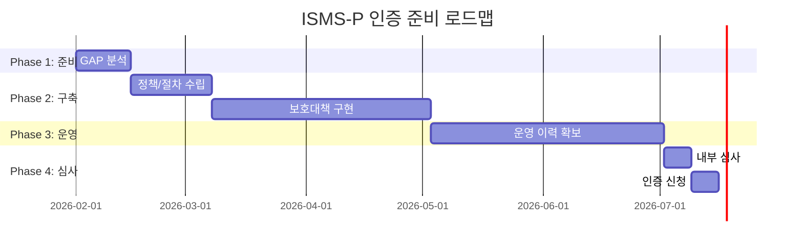

# ISMS-P 인증 준비 가이드

## 준비 단계 개요

## 단계별 상세

### Phase 1: GAP 분석 (1-2주)
**목표**: 현재 수준과 인증기준 간 차이 식별

**산출물**:
- GAP 분석 보고서
- 보완 조치 계획서
- 예산 및 일정 계획

**주의사항**:
- 모든 영역 빠짐없이 점검
- 증적 확보 가능 여부 확인
- 경영진 보고 및 승인 필수

### Phase 2: 정책/절차 수립 (2-3주)
**목표**: 문서 체계 구축

**산출물**:
- 정보보호 정책서
- 분야별 지침/절차서
- 양식 및 템플릿

**주의사항**:
- 조직 실정에 맞게 작성
- 경영진 승인 필수
- 배포 및 공지 증적 확보

### Phase 3: 보호대책 구현 (4-8주)
**목표**: 기술적/관리적 조치 이행

**산출물**:
- 시스템 구성 현황
- 접근권한 관리 현황
- 취약점 점검 결과

**주의사항**:
- 단계별 이행 증적 확보
- 예외 사항 승인 문서화
- 정기 점검 일정 수립

### Phase 4: 운영 이력 확보 (2개월+)
**목표**: 최소 2개월 운영 실적 확보

**인정되는 운영 활동**:
- 정책 시행 기록
- 로그 수집/보관
- 교육 실시 기록
- 취약점 점검 수행
- 보안 이벤트 처리
- 변경 관리 이력

**운영 이력 요건**:
| 구분 | 법정 요건 | 실무 권장 |
|------|----------|----------|
| 의무대상자 | 최소 2개월 | 6개월 (충분한 증적 확보) |
| 자율대상자 | 없음 | 최소 3개월 (심사 시 유리) |

**운영 증적 예시**:
- 월별 정책 이행 점검 기록
- 보안 이벤트 처리 이력 (탐지-분석-조치-보고)
- 변경 관리 승인 기록
- 접근권한 정기 검토 결과
- 교육 실시 및 이수 기록

**주의사항**:
- 운영 증적 체계적 관리
- 경영진 정기 보고 이행

### Phase 5: 내부 심사 (1주)
**목표**: 인증심사 전 자체 점검

**산출물**:
- 내부 심사 결과 보고서
- 발견사항 조치 계획

**주의사항**:
- 독립성 있는 심사원 구성
- 모든 영역 점검
- 발견사항 완료 전 인증 신청 금지

## 빈발 결함 주의사항

### 경영진 참여 (1.1.1)
- ❌ 분기별 보고 누락
- ❌ 경영진 승인 증적 없음
- ✅ 정기 보고 일정 수립 및 이행

### 조직 구성 (1.1.3)
- ❌ 실무부서장만으로 위원회 구성
- ❌ 위원회 미운영
- ✅ 임원급 포함, 정기 회의 개최

### 접근통제 (2.5.4, 2.6.x)
- ❌ P2P/웹하드 무단 허용
- ❌ 예외 승인 절차 미수립
- ✅ 예외 신청/승인 절차 수립 및 이행

### 패스워드 관리 (2.4.4)
- ❌ 정책 미수립
- ❌ 이행 점검 미실시
- ✅ 정책 수립 및 정기 점검
