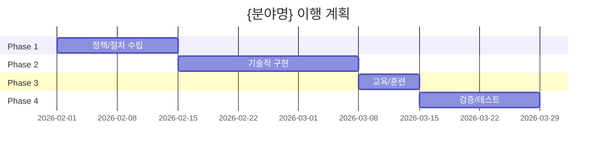

<!--
  ISMS-P 이행 계획 템플릿

  사용법:
  1. {분야명}, {항목 번호}, {항목명} 등 중괄호 내용을 실제 값으로 교체
  2. Phase별 기간은 조직 상황에 맞게 조정
  3. 담당자, 완료 예정일, 예산 등 빈칸 채우기
  4. Mermaid gantt의 시작일을 실제 날짜로 변경

  예시: /isms 인적보안 계획
-->

# ISMS-P 이행 계획: {분야명}

## 개요

- 대상 항목: {항목 번호 범위}
- 총 항목 수: {N}개
- 예상 기간: {N}주
- 우선순위: {높음/보통/낮음}
- 난이도: {쉬움/보통/어려움}

## 완료 조건

- [ ] 모든 인증기준 문서화
- [ ] 기술적 구현 완료 및 검증
- [ ] 관련 인력 교육 완료
- [ ] 내부 점검 통과

## Phase 1: 정책/절차 수립 (Week 1-2)

### {항목 번호} {항목명}

**목표**: {정책/절차 문서화 목표}

**태스크**:
- [ ] {항목명} 정책 작성
- [ ] 세부 절차 수립
- [ ] 책임자 및 역할 정의
- [ ] 경영진 승인

**산출물**:
- {항목명} 정책서
- {항목명} 절차서
- 역할 및 책임 매트릭스

**담당자**: ___________
**완료 예정**: ___________

---

## Phase 2: 기술적 구현 (Week 3-5)

### {항목 번호} {항목명}

**목표**: {기술적 구현 목표}

**태스크**:
- [ ] 요구사항 분석
- [ ] 시스템/도구 선정
- [ ] 구현 및 설정
- [ ] 단위 테스트

**산출물**:
- 요구사항 명세서
- 구현 시스템/도구
- 설정 가이드
- 테스트 결과 보고서

**담당자**: ___________
**완료 예정**: ___________

**기술 스택**:
- ___________
- ___________

---

## Phase 3: 교육/훈련 (Week 6)

**목표**: 관련 인력의 정책/절차 이해 및 숙지

**태스크**:
- [ ] 교육 자료 준비
- [ ] 대상자별 교육 실시
  - 관리자 교육
  - 실무자 교육
  - 전체 임직원 교육
- [ ] 교육 이수 기록 관리
- [ ] 교육 효과성 평가

**산출물**:
- 교육 자료 (PPT, 매뉴얼)
- 교육 이수 기록
- 효과성 평가 보고서

**담당자**: ___________
**완료 예정**: ___________

---

## Phase 4: 검증/테스트 (Week 7-8)

**목표**: 인증기준 준수 여부 확인

**태스크**:
- [ ] 정책/절차 준수 여부 점검
- [ ] 기술적 구현 검증
- [ ] 통합 테스트
- [ ] 내부 심사 수행
- [ ] 발견사항 조치

**산출물**:
- 점검 체크리스트
- 검증 보고서
- 내부 심사 보고서
- 조치 계획 및 결과

**담당자**: ___________
**완료 예정**: ___________

---

## 리스크 및 대응

| 리스크 | 영향도 | 발생 가능성 | 대응 방안 |
|--------|--------|-----------|----------|
| 기존 시스템과의 통합 어려움 | 높음 | 중간 | 단계적 적용, 파일럿 테스트 |
| 담당자 부재 | 중간 | 낮음 | 백업 담당자 지정 |
| 예산 부족 | 중간 | 중간 | 오픈소스 도구 활용, 단계별 예산 확보 |
| 일정 지연 | 높음 | 중간 | 주간 진행 상황 점검, 병목 조기 식별 |

## 의존성

**선행 필요 항목**:
- {항목 번호}: {항목명} - {이유}

**후속 작업**:
- {항목 번호}: {항목명} - {이유}

## 예산

| 항목 | 예상 비용 | 비고 |
|------|----------|------|
| 도구/시스템 도입 | ___________원 | |
| 교육 | ___________원 | |
| 외부 컨설팅 | ___________원 | |
| **합계** | **___________원** | |

## 추적 지표

- [ ] 정책 문서 승인 완료
- [ ] 기술 구현 완료율: 0%
- [ ] 교육 이수율: 0%
- [ ] 내부 점검 준수율: 0%

## 마일스톤

**[중요] 아래 Mermaid 차트의 시작일(2026-02-01)을 실제 프로젝트 시작일로 변경하세요.**

---

**참고 문서**: prompts/skills/isms/resources/{파일명}.md

**검토 주기**: 주 1회

**최종 업데이트**: {날짜}
