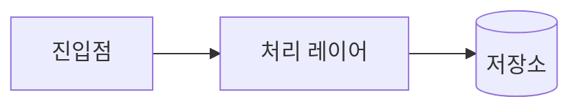

# Architecture

## Overview

<!-- 프로젝트 한 줄 요약 + 핵심 기술 스택 -->

[프로젝트명]은 [목적]. [주요 기술 스택].

## Structure

<!-- 모듈/디렉토리별 책임. 핵심 모듈만 기술 (5-10개) -->

| 모듈/디렉토리 | 책임 |
|--------------|------|
| `src/` | [설명] |

## Constraints

<!-- 깨지면 안 되는 규칙 (3-10개). 에이전트 위임 시 가장 중요한 섹션 -->
<!-- 예: 의존 방향, API 계약, 성능 요구사항, 보안 제약 -->

1. [의존 방향 규칙]
2. [API 계약]
3. [성능 제약]

## Data Flow

<!-- 주요 데이터 흐름. 텍스트 또는 mermaid 다이어그램 -->

**핵심 경로**:
1. [경로 설명]

## Extension Points

<!-- 확장 예정/허용 지점. 현재와 향후 방향 -->

| 지점 | 현재 상태 | 확장 방향 |
|------|----------|----------|
| [지점명] | [현재] | [향후] |

## Decisions

<!-- 핵심 아키텍처 결정 + WHY. 상세 내용은 ADR에 위임 -->

| 결정 | 이유 | 대안 |
|------|------|------|
| [무엇을 선택했는가] | [WHY] | [고려했으나 버린 것] |
