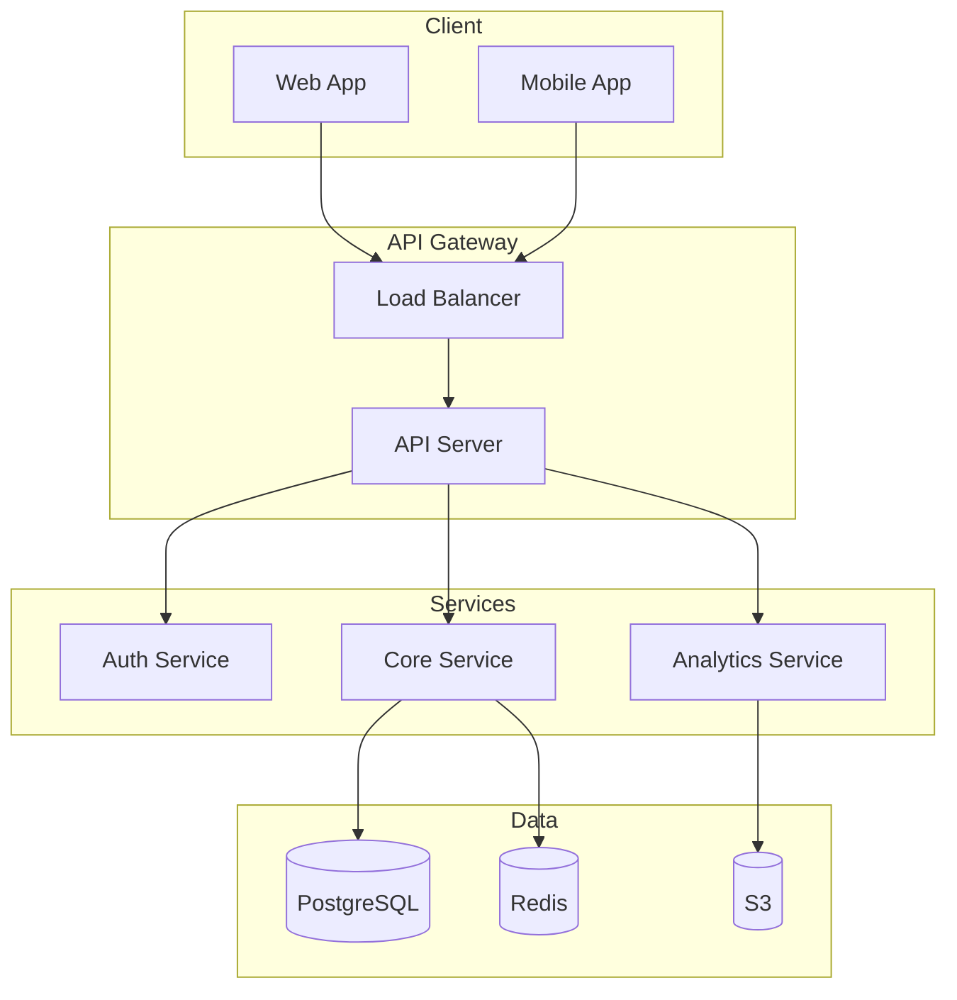
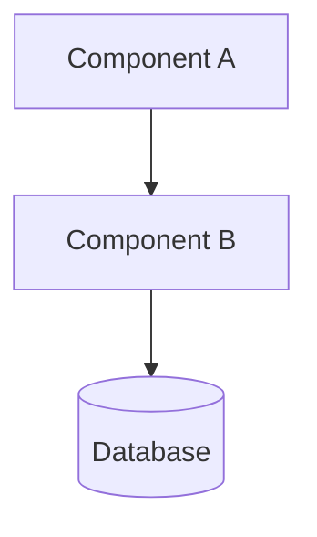
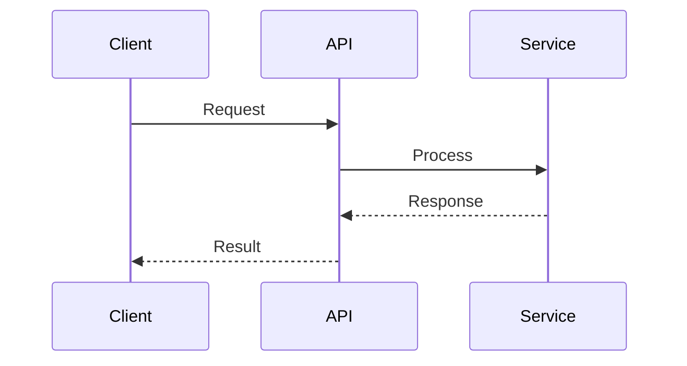

# 기술 아키텍처 (Architecture) 섹션 작성 가이드

기술적 신뢰성을 보여주는 핵심 섹션입니다.

## 목적

- 시스템의 기술적 구조 설명
- 기술 선택의 합리성 제시
- 확장성/안정성 입증

## 포함해야 할 내용

### 1. 시스템 구조
- [ ] 전체 아키텍처 다이어그램
- [ ] 각 계층/컴포넌트 설명
- [ ] 컴포넌트 간 상호작용

### 2. 기술 스택
- [ ] 사용 기술 목록
- [ ] 각 기술 선택 이유
- [ ] 대안 기술 대비 장점

### 3. 데이터 흐름
- [ ] 데이터 입력 → 처리 → 출력
- [ ] 데이터 저장 구조
- [ ] 실시간/배치 처리 구분

### 4. 보안
- [ ] 보안 아키텍처
- [ ] 인증/권한 체계
- [ ] 데이터 보호 방안

### 5. 확장성
- [ ] 수평/수직 확장 전략
- [ ] 예상 처리량
- [ ] 병목 대응 방안

## 작성 팁 (투자자 관점)

### DO (해야 할 것)
- **다이어그램 필수**: 텍스트만으로는 이해 어려움
- **기술 선택 근거**: "왜 이 기술인가?" 설명
- **성능 수치 제시**: 처리량, 응답시간, 가용성
- **업계 표준 준수**: 검증된 기술/패턴 활용

### DON'T (피해야 할 것)
- 기술 용어만 나열
- 과도한 복잡성
- 근거 없는 성능 주장
- 보안 고려 누락

## 예시 구조

```markdown
## 4. 기술 아키텍처

### 4.1 시스템 구조



**계층별 설명**

| 계층 | 역할 | 구성요소 |
|------|------|----------|
| Client | 사용자 인터페이스 | React Web, React Native |
| Gateway | 트래픽 관리, 인증 | AWS ALB, Kong |
| Services | 비즈니스 로직 | Node.js 마이크로서비스 |
| Data | 데이터 저장 | PostgreSQL, Redis, S3 |

### 4.2 기술 스택

| 계층 | 기술 | 선택 이유 |
|------|------|-----------|
| Frontend | React | 컴포넌트 재사용성, 큰 생태계 |
| Backend | Node.js | 비동기 처리, 빠른 개발 |
| Database | PostgreSQL | ACID 준수, JSON 지원 |
| Cache | Redis | 밀리초 응답, 클러스터 지원 |
| Cloud | AWS | 글로벌 인프라, 다양한 서비스 |

### 4.3 데이터 흐름

1. **입력**: 클라이언트 요청 → API Gateway
2. **인증**: JWT 토큰 검증 → Auth Service
3. **처리**: 비즈니스 로직 → Core Service
4. **저장**: 트랜잭션 처리 → PostgreSQL
5. **캐싱**: 조회 결과 → Redis
6. **응답**: 결과 반환 → 클라이언트

### 4.4 보안

**인증/권한**
- OAuth 2.0 / JWT 기반 인증
- RBAC(Role-Based Access Control)

**데이터 보호**
- 전송: TLS 1.3
- 저장: AES-256 암호화
- 개인정보: 가명처리/마스킹

**인프라 보안**
- VPC 격리
- WAF 적용
- 정기 취약점 점검

### 4.5 확장성

**목표 성능**
- 동시 사용자: 10,000명
- API 응답시간: < 200ms (p99)
- 가용성: 99.9%

**확장 전략**
- 수평 확장: Auto Scaling Group
- DB 확장: Read Replica + 샤딩
- 캐시 확장: Redis Cluster
```

## 다이어그램 가이드

### Mermaid 기본 템플릿

**시스템 아키텍처**


**시퀀스 다이어그램**


## 분량 가이드

| 항목 | 권장 분량 |
|------|-----------|
| 시스템 구조 | 300-400단어 + 다이어그램 |
| 기술 스택 | 200-300단어 |
| 데이터 흐름 | 200-300단어 |
| 보안 | 200-300단어 |
| 확장성 | 150-200단어 |
| **전체** | **1,050-1,500단어** |

## 체크리스트

작성 완료 후 확인:
- [ ] 다이어그램이 명확한가?
- [ ] 기술 선택 이유가 타당한가?
- [ ] 보안 고려가 충분한가?
- [ ] 확장성 계획이 있는가?
- [ ] 개발자가 구현 가능한 수준인가?

## 프로젝트 유형별 추가 고려사항

### AI 프로젝트
- 모델 아키텍처 상세
- 학습/추론 파이프라인
- GPU 인프라

### 블록체인 프로젝트
- 컨센서스 메커니즘
- 스마트 컨트랙트 구조
- 노드 아키텍처
