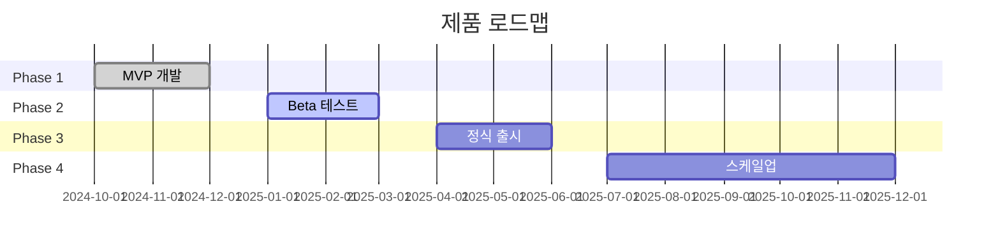

# 로드맵 (Roadmap) 섹션 작성 가이드

실행 계획과 비전을 보여주는 섹션입니다.

## 목적

- 개발/사업 일정 제시
- 마일스톤 명확화
- 장기 비전 공유

## 포함해야 할 내용

### 1. 개발 단계
- [ ] 단계별 목표
- [ ] 주요 기능/결과물
- [ ] 예상 완료 시점

### 2. 마일스톤
- [ ] 측정 가능한 목표
- [ ] 완료 기준
- [ ] 의존성/선행 조건

### 3. 장기 비전
- [ ] 1년/3년/5년 목표
- [ ] 확장 계획
- [ ] 최종 비전

## 작성 팁 (투자자 관점)

### DO (해야 할 것)
- **현실적 일정**: 달성 가능한 목표 설정
- **측정 가능한 마일스톤**: "완료" 기준 명확
- **유연성 확보**: 피봇 가능성 고려
- **진행 상황 표시**: 완료된 항목 표시

### DON'T (피해야 할 것)
- 너무 상세한 일정 (6개월 이상은 분기 단위)
- 비현실적 목표
- 외부 의존 요소 무시
- 버퍼 없는 빡빡한 일정

## 예시 구조

```markdown
## 7. 로드맵

### 7.1 개발 단계

```
2024 Q4          2025 Q1          2025 Q2          2025 Q3          2025 Q4
    │                │                │                │                │
    ▼                ▼                ▼                ▼                ▼
┌────────┐      ┌────────┐      ┌────────┐      ┌────────┐      ┌────────┐
│Phase 1 │      │Phase 2 │      │Phase 3 │      │Phase 4 │      │Phase 5 │
│  MVP   │ ──▶  │ Beta   │ ──▶  │Launch  │ ──▶  │ Scale  │ ──▶  │Expand  │
│ 개발   │      │ 테스트 │      │ 정식   │      │ 확장   │      │ 글로벌 │
└────────┘      └────────┘      └────────┘      └────────┘      └────────┘
   [완료]          [진행중]
```

### Phase 1: MVP 개발 (2024 Q4) ✅ 완료
**목표**: 핵심 기능 개발 및 내부 테스트

- [x] 핵심 API 개발
- [x] 기본 UI 구현
- [x] 내부 알파 테스트
- [x] 초기 고객 3사 확보

**결과물**
- MVP 버전 v0.1
- 기술 문서 초안
- 초기 고객 피드백

### Phase 2: Beta 테스트 (2025 Q1) 🔄 진행중
**목표**: 제한적 공개 및 피드백 수집

- [x] 베타 버전 배포
- [ ] 베타 고객 10사 확보
- [ ] 피드백 기반 개선
- [ ] 성능 최적화

**결과물**
- Beta 버전 v0.5
- 사용자 가이드
- 성능 벤치마크 보고서

### Phase 3: 정식 출시 (2025 Q2)
**목표**: 공개 출시 및 초기 성장

- [ ] 정식 버전 출시
- [ ] 마케팅 캠페인 시작
- [ ] 고객 지원 체계 구축
- [ ] 유료 전환 시작

**결과물**
- GA 버전 v1.0
- 가격 정책 확정
- 고객 지원 포털

### Phase 4: 스케일업 (2025 Q3-Q4)
**목표**: 성장 가속화

- [ ] 엔터프라이즈 기능 추가
- [ ] 파트너 채널 확대
- [ ] 시리즈 A 투자 유치
- [ ] 팀 확장 (20명)

**결과물**
- Enterprise 버전
- 파트너 프로그램
- 시리즈 A 완료

### Phase 5: 글로벌 확장 (2026~)
**목표**: 해외 시장 진출

- [ ] 일본 시장 진출
- [ ] 동남아 시장 확대
- [ ] 현지화 완료
- [ ] 해외 매출 30% 달성

### 7.2 마일스톤 요약

| 마일스톤 | 목표 | 완료 기준 | 상태 |
|----------|------|-----------|------|
| MVP 완료 | 핵심 기능 | 내부 테스트 통과 | ✅ |
| 베타 출시 | 제한 공개 | 고객 10사 온보딩 | 🔄 |
| GA 출시 | 정식 출시 | 매출 발생 | ⏳ |
| 시리즈 A | 투자 유치 | XX억원 확보 | ⏳ |
| 글로벌 | 해외 진출 | 해외 매출 30% | ⏳ |

### 7.3 장기 비전

**1년 후 (2025 말)**
- 국내 고객 100사
- ARR XX억원
- 시장 점유율 5%

**3년 후 (2027)**
- 아시아 3개국 진출
- ARR XXX억원
- 업계 Top 3

**5년 후 (2029)**
- 글로벌 10개국
- ARR X,XXX억원
- 업계 1위
```

## Mermaid 타임라인 템플릿



## 분량 가이드

| 항목 | 권장 분량 |
|------|-----------|
| 개발 단계 | 400-600단어 |
| 마일스톤 요약 | 100-200단어 |
| 장기 비전 | 150-250단어 |
| **전체** | **650-1,050단어** |

## 체크리스트

작성 완료 후 확인:
- [ ] 일정이 현실적인가?
- [ ] 마일스톤이 측정 가능한가?
- [ ] 현재 진행 상황이 표시되어 있는가?
- [ ] 장기 비전이 설득력 있는가?

## 프로젝트 유형별 마일스톤

### AI 프로젝트
- PoC 완료
- 모델 성능 목표 달성
- 프로덕션 배포
- 정확도 SOTA 달성

### 블록체인 프로젝트
- 테스트넷 출시
- 메인넷 출시
- TGE (토큰 출시)
- TVL 목표 달성

### SaaS 프로젝트
- MVP 출시
- 첫 유료 고객
- MRR 목표 달성
- 시리즈 A

## 안티패턴

### 나쁜 예시
> "2025년: 제품 개발
> 2026년: 성장
> 2027년: 글로벌 확장"

**문제점**: 너무 추상적, 측정 불가, 실행 계획 없음

### 좋은 예시
> "2025 Q2: 정식 출시
> - 완료 기준: 유료 고객 10사 확보
> - 결과물: GA v1.0, 가격 정책 확정
> - 선행 조건: Beta 테스트 완료, 피드백 반영"

**장점**: 구체적 시점, 측정 가능, 의존성 명확
